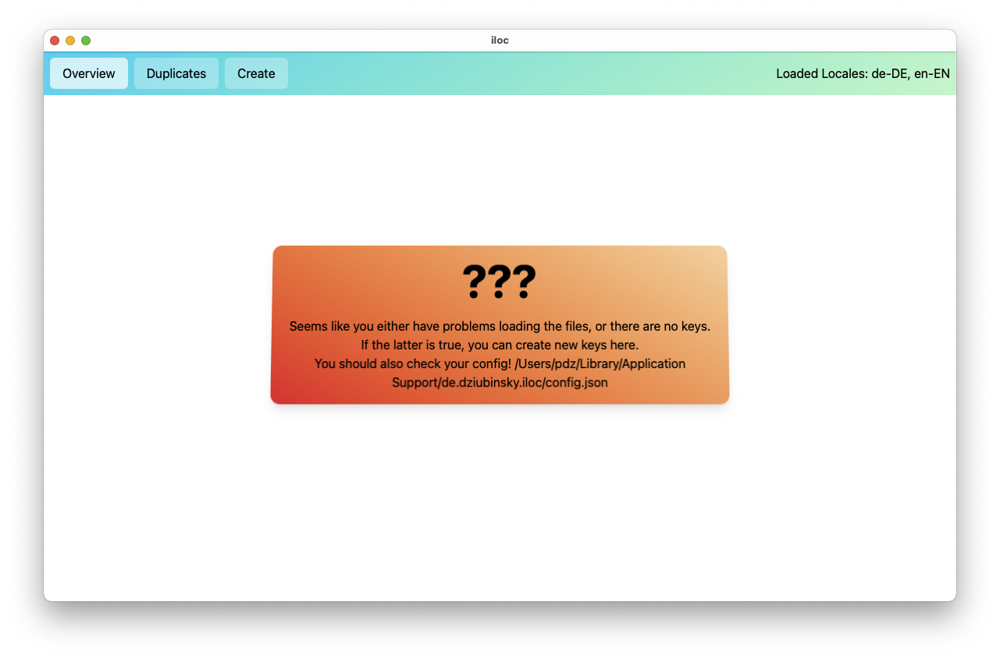
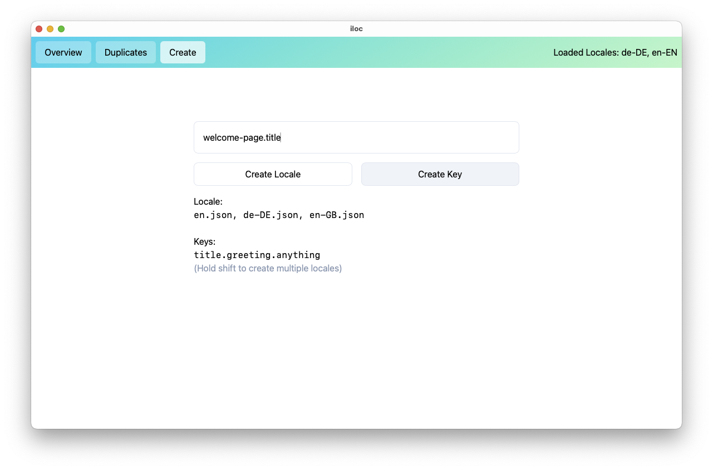
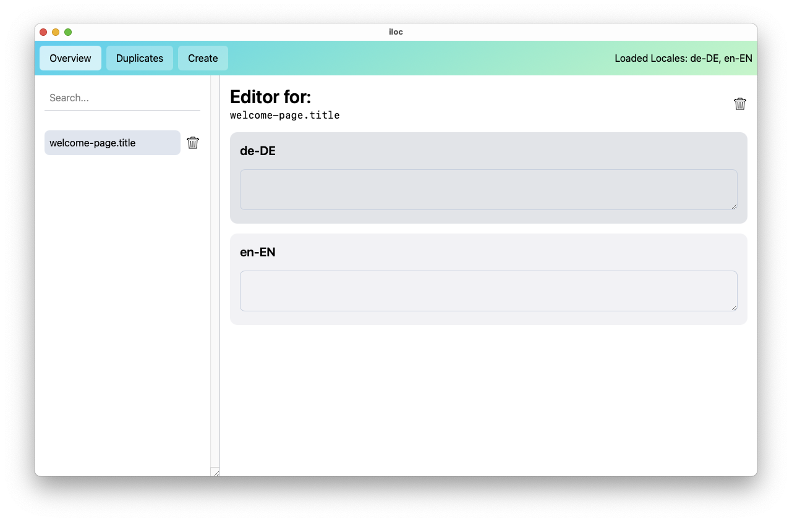

# iloc

Program to localize quickly.

## usage

1. download
2. `bun install`
3. `bun run tauri dev`
4. Go to config directory and edit `config.json` to your needs.

## todos:

- [ ] add a way to change messages directory.
- [ ] refresh on config change w/out errors
- [ ] add support for nested keys
- [x] add support for searching for content rather then only keys

# Screenshots

## Home

## Create key

## Edit View

